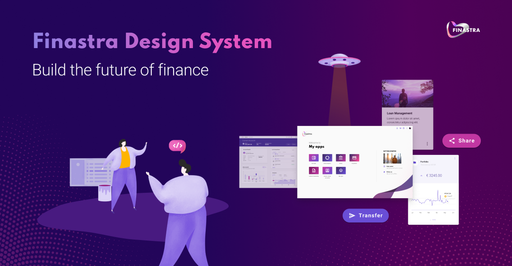

Welcome to the [Finastra design system](https://design.fusionfabric.cloud/) repository. You will find here all the assets and ressources to **build Angular applications quickly and consistently**. It will also help you easily applying **Finastra branding and UX best practices**.

If you are looking for a modern, framework agnostic version of the Finastra design system check our [web components implementation](https://github.com/Finastra/finastra-design-system).

# Angular theme

`@finastra/angular-theme`

A CSS implementation of our foundations specifically made for Angular.

[Learn more](./themes/angular-theme/README.md)

# Angular components

`@finastra/angular-components`

An angular implementation of the Finastra design system components. It provides all [the necessary components](https://lucid-bassi-bfa8cc.netlify.app/) to make fast and cohesive financial apps.

[Learn more](./packages/angular-components/README.md)

# 💌 Want to help?

Want to file a bug, contribute some code, or improve documentation?
Excellent! Consider reading our [contribution guidelines](./CONTRIBUTING.md).
